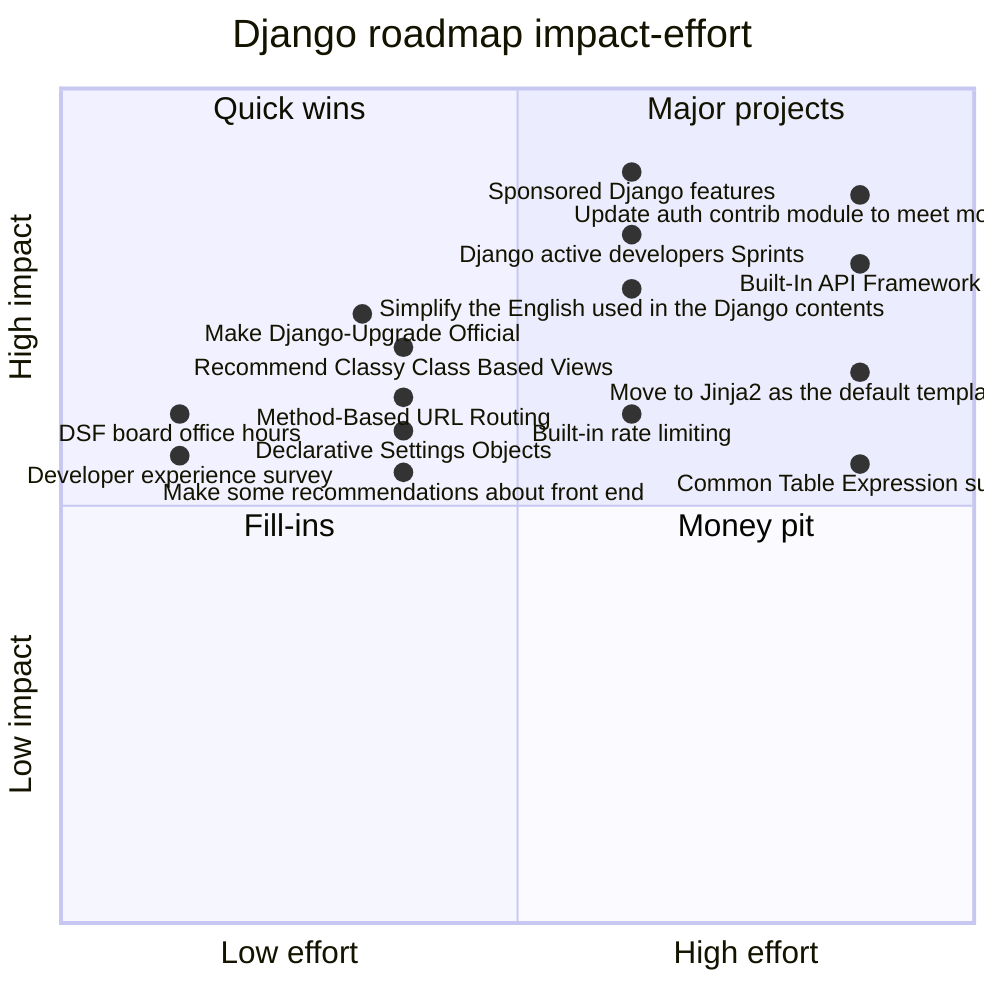

Today, we can all have a pony! 🌈

13 Django contributors met on January 29th 2024, and drafted the following roadmap.

<!-- more -->

## Ideas by vote

Of 52 ideas, 26 got more than one vote. We discussed 15 during the workshop.

Discussed during the workshop:

- [Update auth contrib module to meet modern standards 👍10 ⭐1](#update-auth-contrib-module-to-meet-modern-standards-10-1)
- [Django active developers Sprints 👍8⭐4](#django-active-developers-sprints-84)
- [DSF board office hours 👍8](#dsf-board-office-hours-8)
- [Sponsored Django features 👍7 ⭐3](#sponsored-django-features-7-3)
- [Make Django-Upgrade Official 👍7](#make-django-upgrade-official-7)
- [Built-In API Framework 👍6 ⭐2](#built-in-api-framework-6-2)
- [Common Table Expression (CTE) support 👍6 ⭐1](#common-table-expression-cte-support-6-1)
- [Move to Jinja2 as the default template language 👍5](#move-to-jinja2-as-the-default-template-language-5)
- [Built-in rate limiting 👍5](#built-in-rate-limiting-5)
- [Recommend Classy Class Based Views 👍4](#recommend-classy-class-based-views-4)
- [Declarative “Settings Objects” 👍4](#declarative-settings-objects-4)
- [Method-Based URL Routing 👍4](#method-based-url-routing-4)
- [Simplify the English used in the Django contents 👍3](#simplify-the-english-used-in-the-django-contents-3)
- [Developer experience survey 👍3](#developer-experience-survey-3)
- [Make some recommendations about front end 👍3](#make-some-recommendations-about-front-end-3)

Left out during the workshop:

- [Background queue/task/worker abstraction 👍3](#background-queuetaskworker-abstraction-3)
- [Update contrib.auth custom model story 👍3](#update-contribauth-custom-model-story-3)
- [Major admin overhaul 👍3](#major-admin-overhaul-3)
- [Developer experience survey 👍3](#developer-experience-survey-3-1)
- [Make some recommendations about front end 👍3](#make-some-recommendations-about-front-end-3-1)
- [Simplify the English used in the Django contents 👍3](#simplify-the-english-used-in-the-django-contents-3-1)
- [Third-party package recommendations 👍2](#third-party-package-recommendations-2)
- [Django writing club 👍2](#django-writing-club-2)
- [Quick start in docs 👍2](#quick-start-in-docs-2)
- [Community tutorial repository 👍2](#community-tutorial-repository-2)
- [Improve Deployment Story 👍2](#improve-deployment-story-2)
- [Improve on startapp / startproject 👍2](#improve-on-startapp--startproject-2)
- [Move management commands to Click 👍2](#move-management-commands-to-click-2)
- [Pluggable Email API 👍2](#pluggable-email-api-2)

## Ideas we refined

### Update auth contrib module to meet modern standards 👍10 ⭐1

High impact, high effort.

> PassKeys, 2FA & passwordless. Perhaps also take some inspiration from the social auth libraries so they can more easily hook in or at least be referenced in the documentation.

#### Making it happen

- Technical team
- Steering Council decision
- Major open source grant

#### Next steps

- Carlton: Get a specification of what “modern standards” means.
  - Speak with e.g. Technical Team, and other folks for this.
- Mark: Review specification from Carlton
- Unassigned: Review existing third party packages that exist based on the first point
- Unassigned: See if there are waypoints we can hit.
  - Can we do it incrementally?
- Unassigned: Turn that into a draft DEP.
- Carlton: blog post about next steps on “Update contrib.auth custom model story”.

### Django active developers Sprints 👍8⭐4

High impact, Mid-high effort. Raised hands: Paolo, Tom, Andy

> [Sprints](https://www.paulox.net/2022/10/26/my-django-active-developers-sprints-proposal/), carried out preferably in person, aimed at working on a specific Django functionality (such as one of those listed in this document). They are organised at a safe distance from the conferences, with the support of some sponsors, involving active contributors in that functionality or aspiring such.

#### Making it happen

- Mergers team
- Releasers team
- Django person writing a [blog post](https://www.paulox.net/2022/10/26/my-django-active-developers-sprints-proposal/)
- Fellow task
- Other solo effort
- Major open source grant
- DSF board discussion or vote

#### Next steps

- Andy: Write a blog post about Virtual Sprints and what next steps could be for this year
- Unassigned: Decide if this is in person or virtual? Virtual sprints low-barrier (The [original proposal](https://www.paulox.net/2022/10/26/my-django-active-developers-sprints-proposal/) is for an in-person-first event)

### DSF board office hours 👍8

Mid-high impact, Low effort. Raised hands: Thibaud

> Once a month, for DSF members only. Talk about matters relating to the Foundation / contributors / members.

#### Making it happen

- DSF board discussion or vote

#### Next steps

- Thibaud: Raise this in the DSF Slack in #board channel.

### Sponsored Django features 👍7 ⭐3

High impact, Mid-high effort.

> Let’s publish an official list of features the DSF would coordinate with contributors to implement if the right sponsor presents themselves.

#### Making it happen

- DSF board discussion or vote

#### Next steps

- Thibaud: Proposal to DSF members mailing list

### Make Django-Upgrade Official 👍7

Mid-high impact, Mid-low effort.

> [Django Upgrade](https://github.com/adamchainz/django-upgrade) makes updating your project for changes a simple case of running a command. New syntax, new APIs etc. If we could make it official we would enable much more ambitious updates.

#### Making it happen

- DSF board discussion or vote

#### Next steps

- Carlton: Talk with Adam about his take on this

### Built-In API Framework 👍6 ⭐2

High impact, high effort.

> Django is increasingly used just as an API server and FastAPI has proven the desire for a framework that has API views and ORMs out of the box (and I think Django is easier to write APIs in even still). We should adopt proper API views in the FastAPI/Ninja style.

#### Making it happen

- Triaging, reviewing, releasing: Fellow task
- Django contributor sprint team
- Google Summer of Code project
- Mergers team
- Releasers team
- DEP / Steering Council decision
- Major open source grant

#### Next steps

- Unassigned: Will require design iteration/negotiation before it gets there
- Unassigned: Evaluate existing 3rd party packages to either: learn from, or incorporate directly into main: django-rest-framework, django-ninja
- Unassigned: Next step is a draft DEP with proposed design and/or inviting design discussion on forum (but that would be better based on a concrete design). Andrew might be able to do this.

### Common Table Expression (CTE) support 👍6 ⭐1

Mid-high impact, high effort.

> See fairly old [Django ticket](https://code.djangoproject.com/ticket/28919). [Optional additional info here](https://www.better-simple.com/django/2024/01/25/informal-django-roadmap/#common-table-expressions-support).

#### Making it happen

- Django contributor sprint team
- Other solo effort

#### Next steps

- Tim & Lily: Discuss and document approach

### Move to Jinja2 as the default template language 👍5

> This is a big one, but I believe it's doable given a few improvements to template backend selection. The main barrier will be all the admin templates, as you cannot (currently?) extend or include templates across engines.

#### Making it happen

- Django contributor sprint team
- DEP / Steering Council decision

#### Next steps

- Thibaud: Create thread on forum for discussion
- Velda: Support starting discussions

### Built-in rate limiting 👍5

Mid-high impact, Mid-high effort. Raised hand: Tom

> This is built in for Rails and Laravel. For authentication-related views in particular – e.g. login.

#### Making it happen

- Security team
- Technical team

#### Next steps

- Tom: Try out as a third-party package
- Tom: Run it by Mark or security team / etc
- Unassigned: Likely will need at least forum discussion, maybe DEP.

### Recommend Classy Class Based Views 👍4

Mid-high impact, Mid-low effort.

> Recommend, but ideally reference [ccbv.co.uk](https://ccbv.co.uk/projects/Django/5.0/) in the docs.

#### Making it happen

- Other solo effort

#### Next steps

- **nassigned: Identify where in the docs links would exist (see [existing reference**
- Unassigned: Create PR with proposed changes to docs / propose to Djangonaut Space mentees

### Declarative “Settings Objects” 👍4

Mid-high impact, Mid-low effort.

> A better way to encapsulate related settings. See the EMAIL\_ settings. Other examples include: various security headers, cookie settings, and I’m sure there are more. A better approach would be some kind of settings object — maybe dataclass based, or similar to those in Pydantic or attrs or elsewhere.

#### Making it happen

#### Next steps

### Method-Based URL Routing 👍4

Mid-high impact, Mid-low effort.

> An additional option in urlpatterns that allows routing by method as well as path if present (matching the first entry that satisfies everything, and allowed method defaulting to all if not provided for back compat)

#### Making it happen

- Django contributor sprint team
- Google Summer of Code project
- DEP / Steering Council decision

#### Next steps

- Unassigned: Needs design doc, discussion, DEP, but then implementation is likely relatively straightforward (few weeks for impl). Andrew happy to mentor this.

### Simplify the English used in the Django contents 👍3

High impact, Mid-high effort.

> The English used in the Django documentation and website is not always as simple as it could be, and sometimes contains unnecessarily complex terms or slang. I explored this topic in depth in my article “[FLOSS and linguistic diversity](https://www.paulox.net/2021/05/12/floss-and-linguistic-diversity/)”.

#### Making it happen

- Django contributor sprint task for one person
- Google Summer of Code project
- Google Season of Docs project
- Accessibility team
- Social media working group

#### Next steps

- Unassigned: Organize a Documentation oriented working group
- Unassigned: Propose for “Google Season of Docs”
- Unassigned: Propose for “GSoC 2023 project ideas”
- Unassigned: Measure the current complexity of English used in documentation
- Ariane: Can help with this

### Developer experience survey 👍3

Mid-high impact, Low effort.

> Let’s ask Django developers what roadblocks they encounter when using Django, and which changes would make it easier for them to be more productive with the framework.

#### Making it happen

- DSF board discussion or vote
- DSF working group proposal

#### Next steps

### Make some recommendations about front end 👍3

Mid-high impact, Mid-low effort.

> It would be nice if Django had something to say about how to handle a modern the front end - perhaps a few different options, e.g. HTMX, and React. Those technologies are just an example, this initiative would pick a handful of them and add a write up to the docs or link to some projects that demonstrate how you can do more modern front end stuff with Django.

#### Making it happen

- Accessibility team

#### Next steps

- Unassigned: ​​Check out this discussion on [Forum ](https://forum.djangoproject.com/t/front-end-options-for-django/14) as the starting point.

## Cursor park (2min)

Rules before the meeting:

1. Don’t edit this document.
2. Don’t vote ahead of time.
3. Don’t comment on ideas.
4. Access this doc with a sign-ed in Google account.
5. Read through the ideas ahead of time if you want a head start.

Feel free to explore the park with your cursor while we get ready

```text
🌳🌳🌳🌳🌳🌳🌳🌳🌳🌳🌳🌳🌳🌳🌳🌳🌳🌳🌳🌳🌹🌱🌱🍄🌷🌱🌳🌱🌱
🌳      🐌      🐐                                                           🌳🌱🌲🌱🌱🌱🌲🌱🌹🌱
🌳                    🌴🐕                       🌷                        🌳🌹🌱🌼🌱🌻 🌱🍀🌿🌱
🌳                🐛                                                           🌳🌱🌱🌲🌼🌾🌱🌱🌲🌱
🌳                                                                                🌳🌱🌱🌱🦄🌱🍄🌱🌷🌱
🌳                        🐝                                                   🌳🌱🌿🌱💐🌱🌱🌳🌾🌱
🌳🌳🌳🌳🌳🌳🌳🌳🌳🌳🌳🌳🌳🌳🌳🌳🌳🌳🌳🌳🌱🌱🌻 🌱🌲🌱💐🌱☘
```

## Agenda (2min)

Introducing the format of the meeting.

- Cursor park (2min)
- Agenda (2min)
- Introductions (5min)
- Ideas (10min + 5min)
- Voting (5min + 5min)
- Impact-effort matrix (5min + 5min)
- Making it happen (5min + 5min)
- Overview (at the end)

## Introductions (5min)

Quick, introduce yourself in three words!

- Thibaud Colas: accessibility, climate action
- Tom Carrick: Hi I’m Tom
- Ariane Djeupang: Rabbit
- Lorenzo Peña: father, cuba, Germany
- Mark Walker: busy, dad, many-hats
- Carlton Gibson: cooking, philosophy, hats
- Paolo Melchiorre: community, open source, Italy
- Tim Schilling: happy, excited, nervous
- Andrew Godwin: excited, mountains, cheese
- Velda Kiara: open source, purple, happy
- Lily Foote: ORM, conferences, fun
- Natalia Bidart: heat, Django Fellow, intrigued
- Andy Miller: freelancer, dad, busy


## Ideas (10min + 5min)

### Community

#### Django writing club 👍2

Once a month / week time for people interested in writing to work together. Meet up online, work on your own articles, give feedback to each others.

#### DSF board office hours 👍8

Once a month, for DSF members only. Talk about matters relating to the Foundation / contributors / members.

#### Django pony stickers 👍1

It’s about time we make the pegasus flying “pony” mascot official. Let’s purchase a license to sell merchandise of the design, and make Django pony merch to sell on [Threadless](https://django.threadless.com/) or [Freewear](https://www.freewear.org/Django).

#### Developer experience survey 👍3

Let’s ask Django developers what roadblocks they encounter when using Django, and which changes would make it easier for them to be more productive with the framework.

#### Developer relations working group 👍0

Django’s marketing is very poor compared to the competition. We need a group to take ownership of the issue, talk to the project’s main users, and get the framework to not feel so dated.

#### Django active developers Sprints 👍8⭐4

[Sprints](https://www.paulox.net/2022/10/26/my-django-active-developers-sprints-proposal/), carried out preferably in person, aimed at working on a specific Django functionality (such as one of those listed in this document). They are organized at a safe distance from the conferences, with the support of some sponsors, involving active contributors in that functionality or aspiring such.

#### Django Developer Certification 👍1

A set of skills and knowledge a Django developer should work to attain to be proficient enough for employment. [Optional additional info here](https://www.better-simple.com/django/2024/01/25/informal-django-roadmap/#django-developer-certification--path).

#### Taking inspiration from Rails & Laravel 👍0

Have a look at what we think these communities do well and learn from them. They are both very popular in the SaaS space in terms of the conversation, Django while being just as good (if not better) rarely gets a mention.

#### Sponsored Django features 👍7 ⭐3

Let’s publish an official list of features the DSF would coordinate with contributors to implement if the right sponsor presents themselves.

### Documentation

#### Recommend Classy Class Based Views 👍4

Recommend, but ideally reference [ccbv.co.uk](https://ccbv.co.uk/projects/Django/5.0/) in the docs.

#### Documentation chatbot 👍0

It is trivial to build a chatbot that does a decent job doing RAG on a set of documentation, giving context-specific answers and links to its source material. We could build one (or use a platform like [scriv.ai](https://scriv.ai/) to add one) and potentially host it somewhere - either on djangoproject.com or on a companion site.

#### Quick start in docs 👍2

Many popular web frameworks, even those based on Python (e.g., Flak, FastAPI) have minimal quick starts in their documentation that demonstrate how you can get started by writing very few lines of code. I propose to add a quick start section in the Django docs to demonstrate its flexibility. See [μDjango](https://www.paulox.net/2023/10/26/udjango_micro_django/).

#### Make some recommendations about front end 👍3

It would be nice if Django had something to say about how to handle a modern the front end - perhaps a few different options, e.g. HTMX, and React. Those technologies are just an example, this initiative would pick a handful of them and add a write up to the docs or link to some projects that demonstrate how you can do more modern front end stuff with Django.

#### Advanced tutorials 👍1

Testing an application, CI/CD examples, formset factory management, advancing and reversing migrations. [Optional additional info here](https://www.better-simple.com/django/2024/01/25/informal-django-roadmap/#advanced-tutorials).

#### Community tutorial repository 👍2

Peer reviewed tutorials that have automated tests to confirm version(s) of Django. [Optional additional info here](https://www.better-simple.com/django/2024/01/25/informal-django-roadmap/#community-tutorial-repository).

#### Official Django Video Content (YouTube Channel) 👍0

Lots of people are looking for video content and most of the existing content is mixed in terms of promoting good practices. This content could be a mix of tutorials and opinion pieces.

#### Simplify the English used in the Django contents 👍3

The English used in the Django documentation and website is not always as simple as it could be, and sometimes contains unnecessarily complex terms or slang. I explored this topic in depth in my article “[FLOSS and linguistic diversity](https://www.paulox.net/2021/05/12/floss-and-linguistic-diversity/)”.

#### Third-party package recommendations 👍2

Let’s endorse obvious choices in the docs or find a way for the community to better advocate for their choices. [Optional additional info here](https://www.better-simple.com/django/2024/01/25/informal-django-roadmap/#third-party-package-recommendations).

### Ecosystem

#### Have ‘official’ third-party packages 👍1

This is fairly broad but generally gives more recognition when there are a default (or two) third-party packages, meaning they get mentioned in the docs where relevant, perhaps moved to a central github org (similar to Jazzband, if not Jazzband itself) to aid in giving authority to those packages.

#### Django package template 👍0

I propose to create templates to create Django packages with all the technologies and best practices that we consider appropriate to improve the Django ecosystem.

#### Maintain a third-party app template (cookiecutter?) 👍0

Let’s maintain a template (cookiecutter maybe?) that lets folks get a 3PA bootstrapped instantly, to make experimenting with new features easier. The answer is always going to be “put it in a third-party app” (3PA) — Django’s stability policy (and its userbase!) requires that we don’t experiment with APIs in Django itself.

### Django website

#### Use of media on the Django website 👍1

The DSF sponsors many initiatives and conferences around the world, and at these conferences a lot of content, such as photos or videos, is produced. The DSF should freely use these media on the Django website to improve communication with the community. See for example [DjangoCon's Flickr account](https://www.flickr.com/photos/djangocon/).

#### Graphic elements on the website 👍0

Increase the amount of visual elements in the Django website content (e.g., graphs and infographics) to improve the communication of information and also in the documentation (e.g., admin screenshots) to simplify learning. SI could take inspiration from the [action to capture screenshots](https://github.com/django/django/blob/main/.github/workflows/screenshots.yml) for testing purposes.

#### Django installation feedback 👍0

On the installation page there are useful links to the Django documentation, the tutorial, the release notes and the community section of the Django website. It might be useful to give more relevance to these sections and also add some request for feedback on the installation or the proposal to join the forum, or the community discord server.

### Deployment

#### DB-backed media storage for simple deployments 👍1

Serving media files from the database eliminates new developers from another production deployment hurdle. [Optional additional info here](https://www.better-simple.com/django/2024/01/25/informal-django-roadmap/#database-backed-media-storage-for-simple-deployments).

#### Improve Deployment Story 👍2

It’s too hard to get your Django app online. Deployment is obviously more than we can cover definitively but there have been numerous discussions about making it easier. We can do better docs, highlighting more modern approaches. We can improve the project templates to make them more deployment ready.

### Authentication

#### Update auth contrib module to meet modern standards 👍10 ⭐1

PassKeys, 2FA & passwordless. Perhaps also take some inspiration from the social auth libraries so they can more easily hook in or at least be referenced in the documentation.

#### Update contrib.auth custom model story 👍3

Django’s leaky battery is the recommendation that users create a custom user model. All folks really wanted was login-by-email, and a custom user model is something of a sledgehammer if all you want to crack is that little nut.

#### Built-in rate limiting 👍5

This is built in for Rails and Laravel. For authentication-related views in particular – e.g. login.

#### Built-in 2FA/Passkey support 👍0

It's the future of authentication, and it feels a little like we're falling behind by not having it easy and built-in. Passkey only may be more reasonable.

### Commands

#### Django announcements via the CLI 👍1

Django should have the ability to render community wide notifications to the terminal. The notifications would be on the level of DjangoCon announcements.

#### Rapid application development commands 👍0

Currently Django already has two very useful commands for starting a project and for starting new applications. It may be useful to provide other commands to create command line templates, related sections in the admin, or views.

#### Improve on startapp / startproject 👍2

The default project and app templates have barely changed at all in the last many years. It would be good if there were an initiative to either refresh them some, or if that’s impossible, come up with a clean path of recommended alternatives to the default set up.

#### Multiple Start Project templates 👍1

It’s come up many times now to change the default template. We should have a (small) number of different startproject options. (Let’s keep it maintainable!). We should also refresh (and promote more) the _Write your own template_ advice.

#### Model chart generators 👍0

Django’s ORM does a great job of converting models into database tables. It could be very useful to have a command that generates graphs starting from models (e.g., UML class diagram) or starting from database tables (e.g., E-R model). The graphics could be in text format (e.g., DOT, mermaid)

#### Move management commands to Click 👍2

The existing way of doing it is a little cumbersome given modern CLI parsing options. This could be done as an optional dependency if wanted.

#### Make Django-Upgrade Official 👍7

[Django Upgrade](https://github.com/adamchainz/django-upgrade) makes updating your project for changes a simple case of running a command. New syntax, new APIs etc. If we could make it official we would enable much more ambitious updates.

### Templates

#### Move to Jinja2 as the default template language 👍5

This is a big one, but I believe it's doable given a few improvements to template backend selection. The main barrier will be all the admin templates, as you cannot (currently?) extend or include templates across engines.

#### React-style {{ children }} block type into the DTL 👍1

The [Slippers](https://mitchel.me/slippers/docs/introduction/) Library implements this.

### Admin

#### Major admin overhaul 👍3

The current admin makes Django look old and dated. The admin needs to feel faster, look great, be fully accessible, and contain more advanced features (admin-wide search, keyboard shortcuts, audit log, etc)

#### Additional admin sections 👍0

There is a recent actions section in the admin, but it might be useful to add one with useful links, for example to the Django documentation, the community section of the Django website, the forum, or the Discord server. Sections may be dynamically deactivated.

#### Data visualisation in admin 👍1

The admin is great for managing and viewing data, but often people want to report on data, visualise their data. It’d be really neat if dashboards/charts/etc could be added to the django admin.

### Settings

#### Declarative “Settings Objects” 👍4

A better way to encapsulate related settings. See the EMAIL\_ settings. Other examples include: various security headers, cookie settings, and I’m sure there are more. A better approach would be some kind of settings object — maybe dataclass based, or similar to those in Pydantic or attrs or elsewhere.

#### Environment-defined Settings 👍1

A standard pattern for every setting in the settings file to have a) a type and b) a defined (programmatically named) environment variable to set it via.

### Routing

#### Drop reverse() 👍0

I'm not entirely sure how important it is these days, and it constrains some of the design of urls, though I suspect I use it a lot less than other people. I would suggest we replace it with a system where URLs of instances are defined on instances.

#### Method-Based URL Routing 👍4

An additional option in urlpatterns that allows routing by method as well as path if present (matching the first entry that satisfies everything, and allowed method defaulting to all if not provided for back compat)

### APIs

#### Built-In API Framework 👍6 ⭐2

Django is increasingly used just as an API server and FastAPI has proven the desire for a framework that has API views and ORMs out of the box (and I think Django is easier to write APIs in even still). We should adopt proper API views in the FastAPI/Ninja style.

#### Faster API responses 👍0

JSON serialisation speed in processing a request is quite slow. See [Web frameworks benchmark](https://klen.github.io/py-frameworks-bench/).

### Other core features

#### Pluggable Email API 👍2

send_email is a little outdated in its assumption you have a plain old SMTP server or sendmail; we should add first-class support for easily configuring a bunch of mainstream email providers.

#### GeoDjango light mode 👍1

I propose to provide a GeoDjango light mode, for the sole storage or querying of spatial data, without the need to install GDAL.

#### Common Table Expression (CTE) support 👍6 ⭐1

See fairly old [Django ticket](https://code.djangoproject.com/ticket/28919). [Optional additional info here](https://www.better-simple.com/django/2024/01/25/informal-django-roadmap/#common-table-expressions-support).

#### Background queue/task/worker abstraction 👍3

Something that fills the gap of "I want a system to run background tasks" in the same sense that Celery does, but a little higher of an abstraction. Could also instead be just a nice abstract interface to various queue backends.

## Voting (5min + 5min)

Vote with emoji reactions in the Google Docs sidebar. You get: 10 👍 “thumbs up” votes each, for ideas you like; one ⭐ “gold star” for your personal highlight; and you can ✋ raise hands for anything you personally would want to contribute to in the next 3 months. Once you’ve voted please update your info here:

| Name             | 👍 thumbs up (10x) | ⭐ gold star (1x) | ✋ raise hand (?x) |
| ---------------- | ------------------ | ----------------- | ------------------ |
| Thibaud Colas    | 10                 | 1                 | 3                  |
| Tom Carrick      | 12                 | 0                 | 2                  |
| Ariane Djeupang  | 9                  | 0                 | 0                  |
| Lorenzo Peña     | 10                 | 1                 | 0                  |
| Mark Walker      | 10                 | 0                 | 1                  |
| Carlton Gibson   | 10                 | 1                 | 0                  |
| Paolo Melchiorre | 10                 | 1                 | 1                  |
| Tim Schilling    | 10                 | 1                 | 2                  |
| Andrew Godwin    | 9                  | 0                 | 0                  |
| Velda Kiara      | 0                  | 1                 | 0                  |
| Lily Foote       | 10                 | 0                 | 0                  |
| Natalia          | 10                 | 1                 | ∞                  |
| Andy Miller      | 10                 | 1                 | 2                  |

## Impact-effort matrix (5min + 5min)

For the top 10-15 most voted items, add them to the board in the appropriate category of the matrix, linking to the idea’s description above.




## Making it happen (5min + 5min)

Now we will classify our Quick wins and Major projects based on how exactly they can be taken forward. We’ll also write down what we think is the most sensible “next step”.

Add the ideas here:

### Solo efforts

👉 _Things that one person can take through start to finish._

- Django contributor sprint task for one person
  - **Simplify the English used in the Django contents 👍4**
- Django person writing a blog post
  - **Django active developers Sprints 👍9✋3 Paolo ⭐**
    - [My Django active developers Sprints proposal 🌅](https://www.paulox.net/2022/10/26/my-django-active-developers-sprints-proposal/)
    - Blog Post about Virtual Sprint that happened last year and learnings
- [Djangonaut Space](https://djangonaut.space/) beginner task
- Fellow task
  - **Built-In API Framework 👍6 ⭐2**
  - **Django active developers Sprints 👍9✋3 Paolo ⭐**
- DSF Board member task
- Other solo effort
  - **Django active developers Sprints 👍9✋3 Paolo ⭐**
    - Is this in person or virtual? Virtual sprints low-barrier (The [original proposal](https://www.paulox.net/2022/10/26/my-django-active-developers-sprints-proposal/) is for an in-person-first event)
  - **Recommend Classy Class Based Views 👍5**
    - Identify where in the docs links would exist
    - **https://docs.djangoproject.com/en/5.0/ref/class-based-views/flattened-index/**
  - **Common Table Expression (CTE) support 👍6**

### Community-driven

👉 _Things that require a group effort where anyone can get involved._

- Django contributor sprint team
  - **Built-In API Framework 👍6 ⭐2**
  - **Method-Based URL Routing 👍5**
  - **Common Table Expression (CTE) support 👍6**
- DSF members discussion / agreement
  - **Move to Jinja2 as the default template language 👍6**
    - Create thread on forum for discussion
- [Google Summer of Code](https://summerofcode.withgoogle.com/) project
  - 👉* See *[_GSoC 2023 project ideas_](https://code.djangoproject.com/wiki/SummerOfCode2023)
  - **Simplify the English used in the Django contents 👍4**
  - **Method-Based URL Routing 👍5**
  - **Built-In API Framework 👍6 ⭐2**
- [Google Season of Docs](https://developers.google.com/season-of-docs) project
  - 👉* See *[_GSoD examples_](https://developers.google.com/season-of-docs/docs/participants)
  - **Simplify the English used in the Django contents 👍4**
- [Outreachy](https://www.outreachy.org/) project
- [DSF Team](https://www.djangoproject.com/foundation/teams/), [Committee](https://www.djangoproject.com/foundation/committees/), [Working Group](https://github.com/django/dsf-working-groups#current-active-working-groups) task
  - [Accessibility team](https://www.djangoproject.com/foundation/teams/#accessibility-team)
    - **Make some recommendations about front end 👍4**
    - **Simplify the English used in the Django contents 👍4**
  - [Mergers team](https://www.djangoproject.com/foundation/teams/#mergers-team)
    - **Built-In API Framework 👍6 ⭐2**
    - **Django active developers Sprints 👍9✋3 Paolo ⭐**
  - [Ops team](https://www.djangoproject.com/foundation/teams/#ops-team)
  - [Releasers team](https://www.djangoproject.com/foundation/teams/#releasers-team)
    - **Built-In API Framework 👍6 ⭐2**
    - **Django active developers Sprints 👍9✋3 Paolo ⭐**
  - [Security team](https://www.djangoproject.com/foundation/teams/#security-team)
    - **Built-in rate limiting 👍6**
      - [https://code.djangoproject.com/ticket/21289](https://code.djangoproject.com/ticket/21289)
      - Try out as a third-party library first?
  - [Steering Council team](https://www.djangoproject.com/foundation/teams/#steering-council-team)
    - **Move to Jinja2 as the default template language 👍6**
  - [Technical advisory team](https://www.djangoproject.com/foundation/teams/#technical-advisory-team-team)
  - [Technical team](https://www.djangoproject.com/foundation/teams/#technical-team-team)
    - **Built-in rate limiting 👍6**
    - **Update auth contrib module to meet modern standards 👍11**
      - First pass: let’s draw up the wish list.
  - [Triage & review team](https://www.djangoproject.com/foundation/teams/#triage-review-team)
  - djangoproject.com maintainers / [Website working group](https://github.com/django/dsf-working-groups/issues/2) (proposed)
  - [Code of Conduct committee](https://www.djangoproject.com/foundation/committees/#conduct) / Code of conduct working group
  - [Fellowship committee](https://www.djangoproject.com/foundation/committees/#fellow) / Fellowship working group
  - [Fundraising working group](https://github.com/django/dsf-working-groups/issues/9)
  - [DjangoCon Europe support working group](https://github.com/django/dsf-working-groups/blob/main/active/dceu.md)
  - [Social media working group](https://github.com/django/dsf-working-groups/blob/main/active/social-media.md)
- **Simplify the English used in the Django contents 👍4**
- [Djangonaut Space](https://djangonaut.space/) team navigator theme for new contributors over 8 weeks
- Kickstarter campaign ($5,000 - $50,000)

### Process-driven

👉 Things that require a very specific process to happen.

- Steering Council decision
  - **Built-In API Framework 👍6 ⭐2**
    - Will require design iteration/negotiation before it gets there
    - Evaluate existing 3rd party packages to either: learn from, or incorporate directly into main
      - django-rest-framework
      - django-ninja
  - **Move to Jinja2 as the default template language 👍6**
  - **Update auth contrib module to meet modern standards 👍11**
- Major open source grant ($25,000 - $250,000)
  - **Django active developers Sprints 👍9✋3 Paolo ⭐**
  - **Update auth contrib module to meet modern standards 👍11**
  - **Built-In API Framework 👍6 ⭐2**
- SC decision / [Process, Feature, or Informational DEP](https://github.com/django/deps) (Django Enhancement Proposal)
  - **Built-In API Framework 👍6 ⭐2**
  - **Move to Jinja2 as the default template language 👍6**
    - Backwards compatibility needs addressing in a DEP
    - [https://lp.jetbrains.com/django-developer-survey-2022/](https://lp.jetbrains.com/django-developer-survey-2022/)
      - 81% of users are on the DTL.
  - **Method-Based URL Routing 👍5**
    - Should be pretty easy and formulaic, may not need one
- DSF board discussion or vote
  - **DSF board office hours 👍9✋TC**
  - **Django active developers Sprints 👍9✋3 Paolo ⭐**
  - **Make Django-Upgrade Official 👍7**
  - **Sponsored Django features 👍8 ⭐3**
  - **Developer experience survey 👍4**
- [DSF working group](https://github.com/django/dsf-working-groups) proposal
  - Developer relations: **Developer experience survey 👍4**
